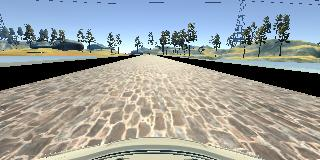
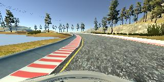
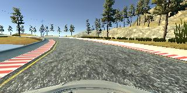
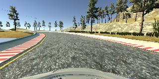
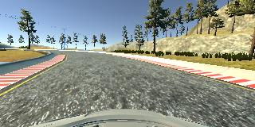
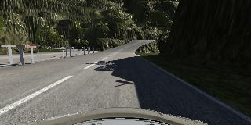
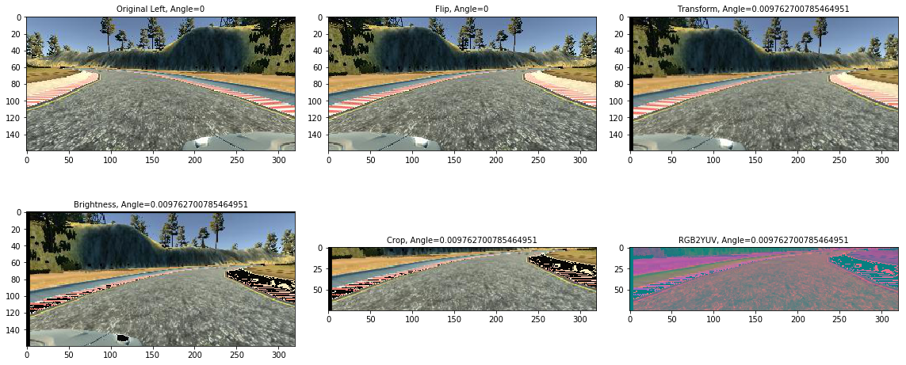
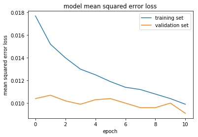
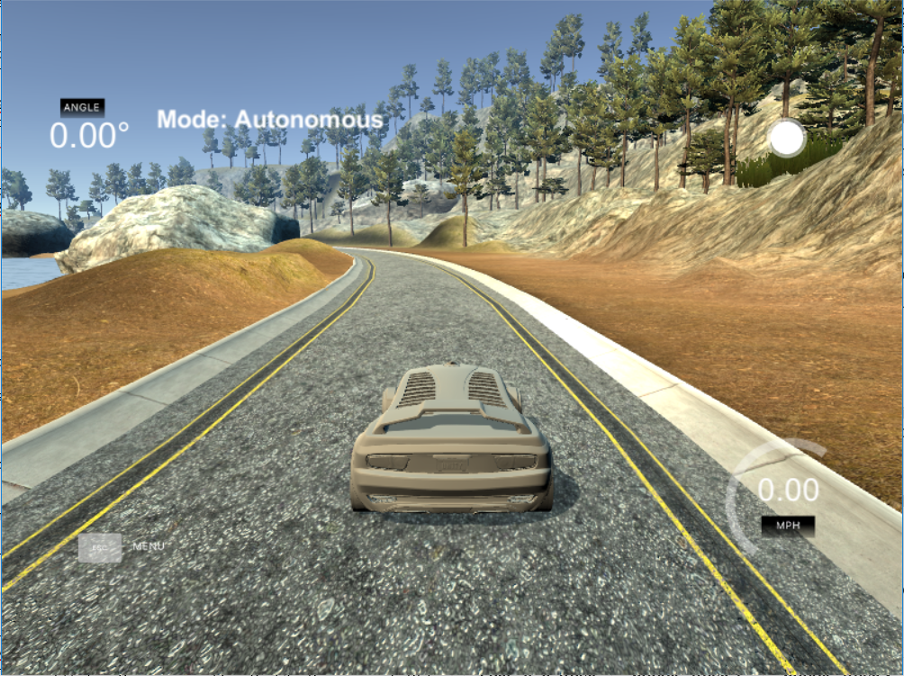

# **Behavioral Cloning** 

**Behavioral Cloning Project**

The goals / steps of this project are the following:
* Use the simulator to collect data of good driving behavior
* Build, a convolution neural network in Keras that predicts steering angles from images
* Train and validate the model with a training and validation set
* Test that the model successfully drives around track one without leaving the road
* Summarize the results with a written report


[//]: # (Image References)

[image1]: ./examples/placeholder.png "Model Visualization"
[image2]: ./examples/placeholder.png "Grayscaling"
[image3]: ./examples/placeholder_small.png "Recovery Image"
[image4]: ./examples/placeholder_small.png "Recovery Image"
[image5]: ./examples/placeholder_small.png "Recovery Image"
[image6]: ./examples/placeholder_small.png "Normal Image"
[image7]: ./examples/placeholder_small.png "Flipped Image"
[videoRun1]: https://youtu.be/2p3xS5VA6UQ
[videoRun4]: https://youtu.be/IwjCBzwH5Sw
[videoRun5]: https://youtu.be/elt_HRAArUY
[videoRun6]: https://youtu.be/4479pd7yYVg

## Rubric Points
### Here I will consider the [rubric points](https://review.udacity.com/#!/rubrics/432/view) individually and describe how I addressed each point in my implementation.  

---
### Files Submitted & Code Quality

#### 1. Submission includes all required files and can be used to run the simulator in autonomous mode

My project includes the following files:
* `model.py` containing the script to create and train the model
* `utils.py` containing the supporting functions.
* `drive.py` updated for driving the car in autonomous mode
* `model-011-run1.h5` containing a trained convolution neural network 
* `model-008-run2.h5` containing a trained convolution neural network 
* `writeup_report.md` summarizing the results

#### 2. Submission includes functional code
Using the Udacity provided simulator and my updated drive.py file, the car can be driven autonomously around the track by executing 
```sh
python drive.py model-011-run1.h5
```
or
```sh
python drive.py model-008-run1.h5
```

#### 3. Submission code is usable and readable

The model.py file contains the code for training and saving the convolution neural network. The file shows the pipeline I used for training and validating the model, and it contains comments to explain how the code works.

### Model Architecture and Training Strategy

#### 1. An appropriate model architecture has been employed

The overall design of the network is based on [the NVIDIA model](https://devblogs.nvidia.com/parallelforall/deep-learning-self-driving-cars/), which has been used by NVIDIA for the end-to-end self driving test.  As such, it is well suited for the project. 

It is a deep convolution network which works well with supervised image classification / regression problems.  As the NVIDIA model is well documented, I was able to focus how to adjust the training images to produce the best result with some adjustments to the model to avoid overfitting and adding non-linearity to improve the prediction.

I used the original NVIDIA model to train for the first Run, later I modified the model for better results like below.

I've added the following adjustments to the model. 

- I used Lambda layer to reshape the image per NVIDIA requirement.
- I used Lambda layer to normalized input images to avoid saturation and make gradients work better.
- I've added an additional dropout layers to avoid overfitting after each convolution layers.
- I've also included RELU for activation function for every layer except for the output layer to introduce non-linearity.

#### 2. Model Architecture
#### Original Nvidia Model:

|Layer (type)                 |Output Shape              |Param #   
|-----------------------------|--------------------------|----------
|lambda_2 (Lambda)            |(None, 160, 320, 3)       |0         
|cropping2d_2 (Cropping2D)    |(None, 75, 320, 3)        |0         
|conv2d_6 (Conv2D)            |(None, 36, 158, 24)       |1824      
|conv2d_7 (Conv2D)            |(None, 16, 77, 36)        |21636     
|conv2d_8 (Conv2D)            |(None, 6, 37, 48)         |43248     
|conv2d_9 (Conv2D)            |(None, 4, 35, 64)         |27712     
|conv2d_10 (Conv2D)           |(None, 2, 33, 64)         |36928     
|dropout_2 (Dropout)          |(None, 2, 33, 64)         |0         
|flatten_2 (Flatten)          |(None, 4224)              |0         
|dense_5 (Dense)              |(None, 100)               |422500    
|dense_6 (Dense)              |(None, 50)                |5050      
|dense_7 (Dense)              |(None, 10)                |510       
|dense_8 (Dense)              |(None, 1)                 |11        
|                             |Total params:             |559,419

#### 2.1. Solution Design Approach

My first step was to use a Nvidia convolution neural network model as is. I thought this model might be appropriate because after reading the NVIDIA paper, I learned that NVIDIA has developed this model for the exact same problem. Except the real life images, we will be feeding the simulator images.

In order to gauge how well the model was working, I split my image and steering angle data into a training and validation set on the original Udacity data plus one track drive. I found that my first model had a low mean squared error on the training set as well as validation set. This implied that the model was just sufficient. 

The final step was to run the simulator to see how well the car was driving around track one. There were a few spots where the vehicle fell off track or not driving in the center. To improve the driving behavior in these cases, I modified the model little bit to add dropout layers after each convolutional layer for better learning, and recorded:
* 5 laps of normal driving
* 5 laps of driving in opposite direction.
* 1 recovery lap in normal direction.
* 1 recovery lap in opposite direction.

At the end of the process, the vehicle is able to drive autonomously around the track without leaving the road.

#### 2.2. Final Model Architecture

The final model architecture (model.py in function build_model()) consisted of a convolution neural network with the following layers and layer sizes ...

#### Modified Nvidia Model:

|Layer (type)                 |Output Shape              |Param #   
|-----------------------------|--------------------------|----------
|lambda_3 (Lambda)            |(None, 66, 200, 3)        |0         
|lambda_4 (Lambda)            |(None, 66, 200, 3)        |0         
|conv2d_11 (Conv2D)           |(None, 31, 98, 24)        |1824      
|spatial_dropout2d_1 (Spatial |(None, 31, 98, 24)        |0         
|conv2d_12 (Conv2D)           |(None, 14, 47, 36)        |21636     
|spatial_dropout2d_2 (Spatial |(None, 14, 47, 36)        |0         
|conv2d_13 (Conv2D)           |(None, 5, 22, 48)         |43248     
|spatial_dropout2d_3 (Spatial |(None, 5, 22, 48)         |0         
|conv2d_14 (Conv2D)           |(None, 3, 20, 64)         |27712     
|spatial_dropout2d_4 (Spatial |(None, 3, 20, 64)         |0         
|conv2d_15 (Conv2D)           |(None, 1, 18, 64)         |36928     
|spatial_dropout2d_5 (Spatial |(None, 1, 18, 64)         |0         
|flatten_3 (Flatten)          |(None, 1152)              |0         
|dense_9 (Dense)              |(None, 1164)              |1342092   
|dense_10 (Dense)             |(None, 100)               |116500    
|dense_11 (Dense)             |(None, 50)                |5050      
|dense_12 (Dense)             |(None, 10)                |510       
|dropout_3 (Dropout)          |(None, 10)                |0         
|dense_13 (Dense)             |(None, 1)                 |11        
|                             |Total params:             |1,595,511

#### 3. Creation of the Training Set & Training Process
#### 4. Appropriate training data

#### Image sizing
1. The Images provided are of size 160x320. However, I removed the unwanted sky and car hood from the image and kept only lane lines in the cropped image.
2. NVIDIA model requires the images of size 66,200. I have added the Lambda layer in the model to resize the image.


#### Image Augmentation
I augmented the images randomly in following ways:
1. Randomly choose center, right or left image.
2. Apply steering bias of +0.2 to left image.
3. Apply steering bias of -0.2 to right image.
4. Randomly flip the image. 
5. Randomly warp transform the image vertically.
6. Apply random brightness to the chosen image.

To start with, I combined the original Udacity provided data with one lap of driving in the center.

I provided this data to the original NVIDIA model. Model did fairly well and drove the car autonomous on the test track. However car was not driving entirely in the center of the road.

To improve the performance, I re-collected the training data to keep the vehicle driving on the road. I used a combination of center lane driving, recovering from the left and right sides of the road. 
To capture good driving behavior: 
i. I first recorded 5 laps on track one using center lane driving. Here is an example image of center lane driving:



ii. Then recorded 5 laps on track one using center lane driving in the opposite direction. 

iii. Then recorded the vehicle recovering from the left side and right sides of the road back to center so that the vehicle would learn to drive back to center of the road if it hits the edges. These images show what a recovery looks like starting from ... :

|||||
|-|-|-|-|

iv. To generalize the data set , I recorded 1 lap on track two in order to get more data points.


v. To augment the data set, I applied the random image augmentation as described above.




I finally randomly shuffled the data set and put 10% of the data into a validation set. 

I used this 90% training data for training the model. The validation set helped determine if the model was over or under fitting. 
For Round 1: The ideal number of epochs was 11 as evidenced by plot below. 



For Round 2: The ideal number of epochs was 8. For the round, unfortunately I was not able to capture the training history to plot the results.

I used an adam optimizer so that manually training the learning rate wasn't necessary.

I ran the training on my workstation entirely using CPU with 24 cores.

#### 5. Results

|Lake Test Track | Jungle Track 1 | Jungle Track 2 |
|----------------|----------------|----------------|
|
|[](https://youtu.be/IwjCBzwH5Sw)|[](https://youtu.be/elt_HRAArUY)|[](https://youtu.be/4479pd7yYVg)
|[YouTube Link](https://youtu.be/IwjCBzwH5Sw)|[YouTube Link](https://youtu.be/elt_HRAArUY)|[YouTube Link](https://youtu.be/4479pd7yYVg)|
